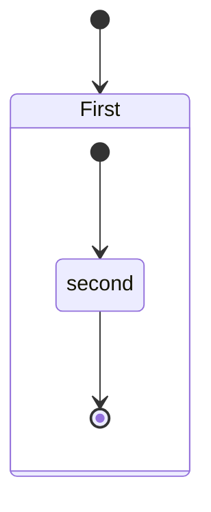

# Vehicle-Control-System

# In the State where the Engine is OFF we can either Turn ON the Engine or QUIT the System
# In the State Engine is ON we can use the Air Conditioner or Engine Cooler or the Accelerator to alter the temperature or the speed of the vehicle Depending on their current temperature and The traffic light to control the speed 

# State Diagram for the System

